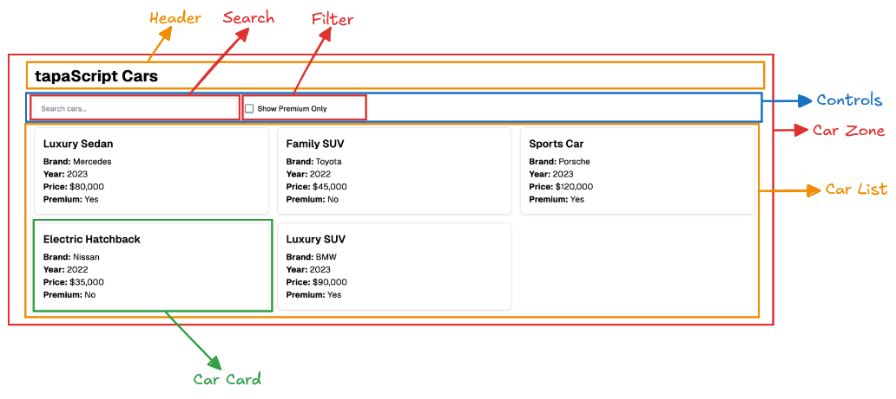
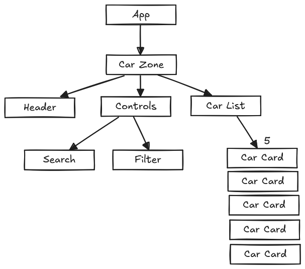
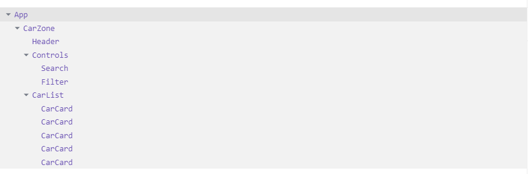

## Overview

Your website is a platform where users can browse through a comprehensive list of cars. This site will serve as a one-stop solution for car enthusiasts, buyers, and sellers to find detailed information about various cars.

## How to run

- Sign in to GitHub and create a new repository.
- Copy the repository URL.
- Open a terminal on your local machine
- Run the following command to clone the repository to your local machine:
git clone [repository URL]
- Move to the cloned repository’s directory:
cd [repository-name]
- Make sure you have Node.jsand npm (Node Package Manager) installed.
- Install the necessary dependencies by running:
npm install
- Start the server using npm:
npm run dev

## Screenshot of the UX design diagram

## Component Breakdown diagram

## Component Hierarchy diagram

## React Dev Tools Screenshot

## Project Live Link

[Car Zone](https://react-with-tapascript-fahad.vercel.app/)?
